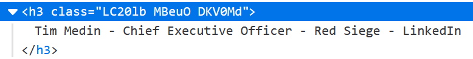

# Yet Another LinkedIn Scraper

As of 03/09/2023, Google appears to be storing search results in `<h3>` elements. This Javascript can be used to scrape employee names and positions from search results.  

## Usage
* Perform a search for `site:linkedin.com/in "Company Name"`  
   
 
* Scroll through all results until results are exhausted  
* Open the developer tools console  
* Paste in the Javascript from scraper.js  
